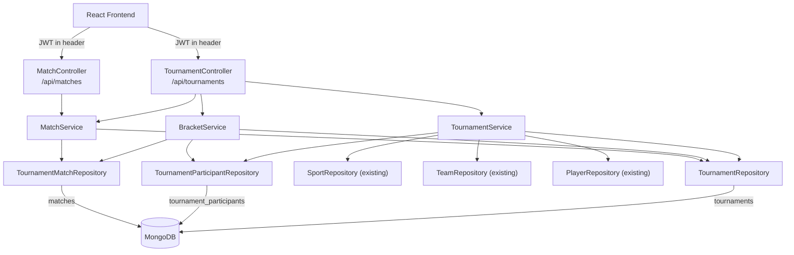

# Design Document — Tournament Management

## Overview

The Tournament Management Module adds single-elimination tournament support to the Vamos platform. It integrates cleanly into the existing Spring Boot 3 / MongoDB / React stack, reusing the `Sport`, `Team`, `Player`, `Captain`, and `User` entities already in the codebase.

Tournaments are tied to a single `Sport`. Registration type (team vs. individual) is derived automatically from `Sport.teamEnabled`, so the same module serves both modes. The lifecycle is:

```
REGISTRATION_OPEN → READY → BRACKET_GENERATED → IN_PROGRESS → COMPLETED
                                                             ↘ CANCELLED (any non-completed state)
```

Bracket generation is triggered automatically when the tournament fills. Admins can also trigger it manually. Each match result advances the winner into the next round, and the final match crowns the champion and closes the tournament.

The module introduces three new collections (`tournaments`, `tournament_participants`, `matches`) and follows the existing `Controller → Service → Repository` layering with `@PreAuthorize` security already wired through the JWT filter.

---

## Architecture

### Component Diagram



### Request Flow

1. React sends a JWT-authenticated HTTP request.
2. `JwtAuthenticationFilter` validates the token and populates `SecurityContextHolder`.
3. `@PreAuthorize` annotations on controller methods enforce role checks.
4. Controllers delegate to services; services call repositories and apply business logic.
5. Custom exceptions bubble up to `GlobalExceptionHandler`, which maps them to structured HTTP responses.

### Design Decisions

- **Auto-trigger bracket generation**: When `currentParticipants == participantLimit` after a registration, `TournamentServiceImpl` calls `BracketService.generateBracket()` in the same transaction scope. This keeps the API surface simple — the frontend does not need to poll for readiness and then call a separate endpoint.
- **`ParticipantType` enum**: A new enum in the tournament sub-package. Although `Player` and `Team` exist in the codebase, there is no shared `ParticipantType` enum yet; adding one here avoids coupling the general entity package to tournament logic.
- **Soft delete for tournaments**: Cancellation sets `status = CANCELLED` rather than removing the document. Match and participant records remain intact for audit purposes.
- **`nextMatchId` / `nextMatchPosition` on matches**: Stored directly on the match document rather than resolved at query time, keeping bracket traversal O(n) with no extra queries.

---

## Components and Interfaces

### Enums

```
package com.example.demo.entities.tournament

TournamentStatus  : REGISTRATION_OPEN, READY, BRACKET_GENERATED, IN_PROGRESS, COMPLETED, CANCELLED
MatchStatus       : PENDING, READY, PLAYED
MatchRound        : QUARTER_FINAL, SEMI_FINAL, FINAL
ParticipantType   : TEAM, PLAYER
```

### Repositories

**`TournamentRepository extends MongoRepository<Tournament, String>`**
```java
List<Tournament> findBySportId(String sportId);
List<Tournament> findByStatus(TournamentStatus status);
```

**`TournamentParticipantRepository extends MongoRepository<TournamentParticipant, String>`**
```java
List<TournamentParticipant> findByTournamentId(String tournamentId);
boolean existsByTournamentIdAndParticipantId(String tournamentId, String participantId);
void deleteByTournamentIdAndParticipantId(String tournamentId, String participantId);
```

**`TournamentMatchRepository extends MongoRepository<TournamentMatch, String>`**
```java
List<TournamentMatch> findByTournamentId(String tournamentId);
List<TournamentMatch> findByTournamentIdAndRound(String tournamentId, MatchRound round);
```

### Service Interfaces

**`TournamentService`**
```java
TournamentResponse create(TournamentCreateRequest request);
List<TournamentResponse> getAll();
TournamentResponse getById(String id);
TournamentResponse update(String id, TournamentUpdateRequest request);
void cancel(String id);
TournamentParticipantResponse registerTeam(String tournamentId, RegisterTeamRequest request);
TournamentParticipantResponse registerPlayer(String tournamentId, RegisterPlayerRequest request);
void removeParticipant(String tournamentId, String participantId);
List<TournamentParticipantResponse> getParticipants(String tournamentId);
```

**`BracketService`**
```java
void generateBracket(String tournamentId);           // auto + manual entry point
BracketResponse getBracket(String tournamentId);
void advanceWinner(TournamentMatch playedMatch, Tournament tournament);
```

**`MatchService`**
```java
MatchResponse recordResult(String matchId, MatchResultRequest request);
MatchResponse getById(String matchId);
List<MatchResponse> getByTournamentId(String tournamentId);
```

### Controllers

**`TournamentController`** — `@RequestMapping("/api/tournaments")`

| Method | Path | Role | Description |
|--------|------|------|-------------|
| POST | `/` | ADMIN | Create tournament |
| GET | `/` | Authenticated | List all tournaments |
| GET | `/{id}` | Authenticated | Get tournament by id |
| PUT | `/{id}` | ADMIN | Update tournament |
| DELETE | `/{id}` | ADMIN | Cancel tournament |
| POST | `/{id}/register-team` | CAPTAIN | Register a team |
| POST | `/{id}/register-player` | PLAYER | Register a player |
| DELETE | `/{id}/participants/{participantId}` | ADMIN | Remove participant |
| GET | `/{id}/participants` | Authenticated | List participants |
| POST | `/{id}/generate-bracket` | ADMIN | Manual bracket generation |
| GET | `/{id}/bracket` | Authenticated | Get bracket response |
| GET | `/{id}/matches` | Authenticated | List tournament matches |

**`MatchController`** — `@RequestMapping("/api/matches")`

| Method | Path | Role | Description |
|--------|------|------|-------------|
| GET | `/{id}` | Authenticated | Get match by id |
| PUT | `/{id}/result` | ADMIN | Record match result |

---

## Data Models

### `Tournament` — collection: `tournaments`

```java
@Document(collection = "tournaments")
@CompoundIndex(def = "{'sportId': 1}")
@CompoundIndex(def = "{'status': 1}")
public class Tournament {
    @Id private String id;
    private String name;
    private String sportId;
    private int participantLimit;        // 4 or 8
    private int currentParticipants;     // default 0
    private TournamentStatus status;     // default REGISTRATION_OPEN
    private String championId;           // null until COMPLETED
    private ParticipantType championType;
    private boolean registrationOpen;    // default true
    private LocalDate startDate;
    private LocalDateTime createdAt;
    private LocalDateTime updatedAt;
}
```

### `TournamentParticipant` — collection: `tournament_participants`

```java
@Document(collection = "tournament_participants")
@CompoundIndex(def = "{'tournamentId': 1, 'participantId': 1}", unique = true)
public class TournamentParticipant {
    @Id private String id;
    private String tournamentId;
    private String participantId;        // teamId or userId (player)
    private ParticipantType participantType;
}
```

### `TournamentMatch` — collection: `matches`

```java
@Document(collection = "matches")
@CompoundIndex(def = "{'tournamentId': 1}")
public class TournamentMatch {
    @Id private String id;
    private String tournamentId;
    private MatchRound round;
    private int matchNumber;
    private String participant1Id;
    private ParticipantType participant1Type;
    private String participant2Id;
    private ParticipantType participant2Type;
    private Integer score1;              // null until PLAYED
    private Integer score2;
    private String winnerId;
    private ParticipantType winnerType;
    private MatchStatus status;
    private String nextMatchId;          // null for Final
    private Integer nextMatchPosition;   // 1 or 2, null for Final
    private LocalDateTime scheduledDate;
    private LocalDateTime createdAt;
}
```

---

## DTOs

### Request DTOs

```java
// TournamentCreateRequest
@NotBlank String name;
@NotBlank String sportId;
@Min(4) @Max(8) int participantLimit;  // custom validator ensures only 4 or 8
@NotNull LocalDate startDate;

// TournamentUpdateRequest
@NotBlank String name;
@NotNull LocalDate startDate;

// RegisterTeamRequest
@NotBlank String teamId;

// RegisterPlayerRequest
@NotBlank String playerId;

// MatchResultRequest
@Min(0) @Max(999) int score1;
@Min(0) @Max(999) int score2;
```

### Response DTOs

```java
// TournamentResponse — all Tournament fields
// TournamentParticipantResponse — id, tournamentId, participantId, participantType
// MatchResponse — all TournamentMatch fields
```

### BracketResponse (React-ready hierarchical tree)

```java
public class BracketResponse {
    String tournamentId;
    ParticipantType participantType;
    ParticipantSummary champion;   // null until COMPLETED

    BracketMatchNode finalMatch;   // always present once bracket is generated

    public static class BracketMatchNode {
        String matchId;
        MatchRound round;
        MatchStatus status;
        ParticipantSummary participant1;
        ParticipantSummary participant2;
        Integer score1;
        Integer score2;
        ParticipantSummary winner;

        // Nested children — null for Final in a 4-participant bracket
        BracketMatchNode semiFinal1;
        BracketMatchNode semiFinal2;
        BracketMatchNode quarterFinal1;  // nested inside semiFinal1
        BracketMatchNode quarterFinal2;  // nested inside semiFinal1
        // semiFinal2 has its own quarterFinal1/quarterFinal2
    }

    public static class ParticipantSummary {
        String id;
        String name;   // resolved display name (teamName or fullName)
    }
}
```

JSON example (8-participant, in progress):
```json
{
  "tournamentId": "t1",
  "participantType": "TEAM",
  "champion": null,
  "final": {
    "matchId": "m7", "round": "FINAL", "status": "PENDING",
    "participant1": null, "participant2": null,
    "score1": null, "score2": null, "winner": null,
    "semiFinal1": {
      "matchId": "m5", "round": "SEMI_FINAL", "status": "PENDING",
      "quarterFinal1": { "matchId": "m1", "round": "QUARTER_FINAL", "status": "READY", ... },
      "quarterFinal2": { "matchId": "m2", "round": "QUARTER_FINAL", "status": "READY", ... }
    },
    "semiFinal2": {
      "matchId": "m6", "round": "SEMI_FINAL", "status": "PENDING",
      "quarterFinal1": { "matchId": "m3", "round": "QUARTER_FINAL", "status": "READY", ... },
      "quarterFinal2": { "matchId": "m4", "round": "QUARTER_FINAL", "status": "READY", ... }
    }
  }
}
```

---

## Bracket Generation Algorithm

### 4-Participant Tournament

Participants are fetched in registration order: P1, P2, P3, P4.

```
Step 1 — Create SF1: participant1=P1, participant2=P2, round=SEMI_FINAL, status=READY,  matchNumber=1
Step 2 — Create SF2: participant1=P3, participant2=P4, round=SEMI_FINAL, status=READY,  matchNumber=2
Step 3 — Create Final:                                  round=FINAL,     status=PENDING, matchNumber=3
Step 4 — SF1.nextMatchId = Final.id, SF1.nextMatchPosition = 1
Step 5 — SF2.nextMatchId = Final.id, SF2.nextMatchPosition = 2
Step 6 — Save all three; set Tournament.status = BRACKET_GENERATED
```

### 8-Participant Tournament

Participants fetched in registration order: P1 … P8.

```
Step 1 — QF1: P1 vs P2, READY,   matchNumber=1
Step 2 — QF2: P3 vs P4, READY,   matchNumber=2
Step 3 — QF3: P5 vs P6, READY,   matchNumber=3
Step 4 — QF4: P7 vs P8, READY,   matchNumber=4
Step 5 — SF1: PENDING,  matchNumber=5
Step 6 — SF2: PENDING,  matchNumber=6
Step 7 — Final: PENDING, matchNumber=7
Step 8 — QF1.nextMatchId=SF1.id, position=1
Step 9 — QF2.nextMatchId=SF1.id, position=2
Step 10— QF3.nextMatchId=SF2.id, position=1
Step 11— QF4.nextMatchId=SF2.id, position=2
Step 12— SF1.nextMatchId=Final.id, position=1
Step 13— SF2.nextMatchId=Final.id, position=2
Step 14— Save all seven; set Tournament.status = BRACKET_GENERATED
```

### Winner Advancement Algorithm (called after every `recordResult`)

```
1. winner = (score1 > score2) ? participant1 : participant2
2. match.winnerId = winner.id; match.winnerType = winner.type
3. match.status = PLAYED

4. IF match.round != FINAL AND match.nextMatchId != null:
     nextMatch = matchRepository.findById(match.nextMatchId)
     IF match.nextMatchPosition == 1:
         nextMatch.participant1Id = winner.id
         nextMatch.participant1Type = winner.type
     ELSE:
         nextMatch.participant2Id = winner.id
         nextMatch.participant2Type = winner.type

     IF nextMatch.participant1Id != null AND nextMatch.participant2Id != null:
         nextMatch.status = READY

     matchRepository.save(nextMatch)

5. IF tournament.status == BRACKET_GENERATED:   // first result
     tournament.status = IN_PROGRESS

6. IF match.round == FINAL:
     tournament.championId = winner.id
     tournament.championType = winner.type
     tournament.status = COMPLETED
     tournament.registrationOpen = false

7. tournament.updatedAt = LocalDateTime.now()
8. tournamentRepository.save(tournament)
9. matchRepository.save(match)
```

---

## Exception Handling

### Custom Exceptions

| Class | HTTP Status | Usage |
|-------|-------------|-------|
| `ResourceNotFoundException` | 404 | Tournament/match/team/player not found |
| `BusinessException` | 400 | Sport mismatch, wrong participant type, registration closed |
| `ConflictException` | 409 | Duplicate registration, match already played, completed tournament modification, bracket already generated |
| `ValidationException` | 400 | Draws, invalid participantLimit |

All exceptions extend a base `ApiException(String message, HttpStatus status)` for uniform handling.

### GlobalExceptionHandler

```java
@RestControllerAdvice
public class GlobalExceptionHandler {

    // Maps ApiException subclasses to their status
    @ExceptionHandler(ResourceNotFoundException.class)
    public ResponseEntity<ErrorResponse> handleNotFound(ResourceNotFoundException ex) { ... }

    @ExceptionHandler(BusinessException.class)
    public ResponseEntity<ErrorResponse> handleBusiness(BusinessException ex) { ... }

    @ExceptionHandler(ConflictException.class)
    public ResponseEntity<ErrorResponse> handleConflict(ConflictException ex) { ... }

    @ExceptionHandler(ValidationException.class)
    public ResponseEntity<ErrorResponse> handleValidation(ValidationException ex) { ... }

    @ExceptionHandler(MethodArgumentNotValidException.class)
    public ResponseEntity<ErrorResponse> handleBeanValidation(...) { ... }

    @ExceptionHandler(Exception.class)
    public ResponseEntity<ErrorResponse> handleGeneric(Exception ex) {
        // Log internally; never expose message or stack trace
        return ResponseEntity.status(500).body(new ErrorResponse("INTERNAL_ERROR",
            "An unexpected error occurred", now()));
    }
}
```

Error response body (always this shape, never a stack trace):
```json
{ "error": "CONFLICT", "message": "Bracket has already been generated", "timestamp": "2025-01-15T10:30:00" }
```

---

## Security

All endpoints require a valid JWT (HTTP 401 if absent or invalid — enforced by existing `JwtAuthenticationFilter`).

Role enforcement via `@PreAuthorize` matching existing project patterns:

```java
// Admin-only mutations
@PreAuthorize("hasRole('ADMIN')")   // POST /api/tournaments
@PreAuthorize("hasRole('ADMIN')")   // PUT  /api/tournaments/{id}
@PreAuthorize("hasRole('ADMIN')")   // DELETE /api/tournaments/{id}
@PreAuthorize("hasRole('ADMIN')")   // DELETE /api/tournaments/{id}/participants/{participantId}
@PreAuthorize("hasRole('ADMIN')")   // POST /api/tournaments/{id}/generate-bracket
@PreAuthorize("hasRole('ADMIN')")   // PUT  /api/matches/{id}/result

// Role-specific registration
@PreAuthorize("hasRole('CAPTAIN')") // POST /api/tournaments/{id}/register-team
@PreAuthorize("hasRole('PLAYER')")  // POST /api/tournaments/{id}/register-player

// All authenticated users
@PreAuthorize("isAuthenticated()")  // All GET endpoints
```

---

## Correctness Properties

*A property is a characteristic or behavior that should hold true across all valid executions of a system — essentially, a formal statement about what the system should do. Properties serve as the bridge between human-readable specifications and machine-verifiable correctness guarantees.*

### Property 1: Tournament initial state invariant

*For any* valid `TournamentCreateRequest`, the created `Tournament` SHALL have `status = REGISTRATION_OPEN`, `registrationOpen = true`, `currentParticipants = 0`, `championId = null`, `championType = null`, and non-null `createdAt`/`updatedAt` timestamps.

**Validates: Requirements 1.1, 1.5**

---

### Property 2: participantLimit only accepts 4 or 8

*For any* integer value that is neither 4 nor 8, a `TournamentCreateRequest` with that `participantLimit` SHALL be rejected with a validation error.

**Validates: Requirements 1.2**

---

### Property 3: Blank/null required fields are rejected

*For any* string composed entirely of whitespace characters submitted as `name`, or a null `startDate`, the `TournamentCreateRequest` SHALL be rejected with HTTP 400.

**Validates: Requirements 1.4**

---

### Property 4: Registration increments participant count and enforces uniqueness

*For any* tournament and any valid participant (matching sport, open registration), each successful registration SHALL increment `currentParticipants` by exactly 1, and a second registration attempt for the same participant SHALL be rejected with HTTP 409.

**Validates: Requirements 3.4, 3.6, 4.4, 4.6**

---

### Property 5: Sport mismatch is always rejected

*For any* pair where the participant's `sportId` differs from the tournament's `sportId`, the registration SHALL be rejected with HTTP 400 and the message `"Participant sport does not match tournament sport"`.

**Validates: Requirements 3.3, 4.3**

---

### Property 6: Registration closed when tournament full; reopened when participant removed

*For any* tournament with `participantLimit` N, after N successful registrations `registrationOpen` SHALL be `false` and `status` SHALL be `READY`. After any subsequent participant removal from a `READY` tournament, `registrationOpen` SHALL be `true` and `status` SHALL be `REGISTRATION_OPEN`.

**Validates: Requirements 3.7, 4.7, 5.3**

---

### Property 7: Bracket structure correctness for 4 participants

*For any* 4-participant tournament, bracket generation SHALL produce exactly 3 `TournamentMatch` documents where: the two SEMI_FINAL matches have `status = READY` and both reference the FINAL match via `nextMatchId`; the FINAL match has `status = PENDING` and `nextMatchId = null`.

**Validates: Requirements 6.2, 6.4**

---

### Property 8: Bracket structure correctness for 8 participants

*For any* 8-participant tournament, bracket generation SHALL produce exactly 7 `TournamentMatch` documents where: 4 QUARTER_FINAL matches have `status = READY`; 2 SEMI_FINAL matches have `status = PENDING`; 1 FINAL match has `status = PENDING`; each QUARTER_FINAL references its correct SEMI_FINAL via `nextMatchId`, and each SEMI_FINAL references the FINAL.

**Validates: Requirements 6.3, 6.4**

---

### Property 9: Winner determination is correct and unambiguous

*For any* READY match and any two scores where `score1 ≠ score2`, recording the result SHALL set `winnerId` to the participant with the higher score, set `winnerType` to that participant's type, and set `match.status = PLAYED`. Equal scores (draws) SHALL always be rejected with HTTP 400.

**Validates: Requirements 7.1, 7.3**

---

### Property 10: Score validity — negatives always rejected

*For any* negative integer submitted as `score1` or `score2`, the `MatchResultRequest` SHALL be rejected with HTTP 400.

**Validates: Requirements 7.2**

---

### Property 11: Winner advances to correct slot in next match

*For any* non-Final match with a `nextMatchId` and `nextMatchPosition`, after recording a result the winner's id SHALL appear in `participant1Id` (if `nextMatchPosition = 1`) or `participant2Id` (if `nextMatchPosition = 2`) of the referenced next match. When both slots are filled, the next match's `status` SHALL become `READY`.

**Validates: Requirements 8.1, 8.2**

---

### Property 12: Tournament lifecycle transitions are monotonic and correct

*For any* tournament, recording the first match result SHALL set `status = IN_PROGRESS`; recording the Final match result SHALL set `status = COMPLETED`, `championId` and `championType` to the winner's values, and `registrationOpen = false` permanently.

**Validates: Requirements 8.3, 8.4, 8.5**

---

### Property 13: updatedAt always advances on state-changing writes

*For any* state-changing operation on a `Tournament` (create, update, cancel, register, remove participant, record result), `updatedAt` after the operation SHALL be greater than or equal to `updatedAt` before the operation.

**Validates: Requirements 2.3, 11.5**

---

### Property 14: BracketResponse is structurally complete

*For any* tournament with a generated bracket, `getBracket()` SHALL return a `BracketResponse` where: `finalMatch` is non-null; for 4-participant tournaments `finalMatch.semiFinal1` and `finalMatch.semiFinal2` are non-null and their `quarterFinal1`/`quarterFinal2` are null; for 8-participant tournaments all quarter-final nodes are non-null.

**Validates: Requirements 6.5**

---

## Error Handling

### Validation Guard Order in `TournamentServiceImpl.registerTeam` / `registerPlayer`

Each registration method applies guards in this fixed order to produce deterministic error messages:

1. Tournament exists → `ResourceNotFoundException` (404)
2. `registrationOpen == true` → `BusinessException` (400) `"Registration is closed for this tournament"`
3. Sport type match (`teamEnabled` vs request type) → `BusinessException` (400)
4. Participant sport matches tournament sport → `BusinessException` (400)
5. Duplicate check → `ConflictException` (409)

### participantLimit Validator

A custom `@ValidParticipantLimit` annotation and corresponding `ConstraintValidator<ValidParticipantLimit, Integer>` are added to enforce the "must be 4 or 8" rule at the Bean Validation layer, so it is caught before the service is even invoked.

```java
@ValidParticipantLimit
private int participantLimit;
```

### Database Error Propagation

All repositories are called without wrapping try-catch in the service layer. Spring's `DataAccessException` hierarchy propagates naturally; `GlobalExceptionHandler.handleGeneric` catches it, logs internally (no stack trace in response), and returns HTTP 500 with `"An unexpected error occurred"`.

---

## Testing Strategy

### Unit Tests

Focus on specific examples and edge cases. Use Mockito to mock repositories.

- `TournamentServiceImplTest`: guard ordering (sport mismatch, registration closed, duplicate), status transitions (READY when full, REGISTRATION_OPEN when participant removed), cancellation guard for COMPLETED tournaments.
- `BracketServiceImplTest`: 4-participant bracket produces exactly 3 matches with correct `nextMatchId` linkage; 8-participant produces 7 matches; `advanceWinner` correctly sets slots and READY status.
- `MatchServiceImplTest`: draw rejection, PENDING rejection, PLAYED rejection (idempotence guard).
- `GlobalExceptionHandlerTest`: each exception type maps to the correct HTTP status and error body shape; generic Exception never leaks stack trace.

### Property-Based Tests (JUnit 5 + jqwik)

PBT applies here because the core logic — participant counting, score comparison, bracket linkage, status transitions — consists of pure business rules that should hold across many varied inputs.

Library: **jqwik** (`net.jqwik:jqwik:1.8.x`)  
Minimum iterations: **100 per property** (`@Property(tries = 100)`)  
Tag format: `// Feature: tournament-management, Property N: <property text>`

| Property | Test Class | jqwik Arbitraries |
|----------|------------|-------------------|
| P1 — Initial state invariant | `TournamentCreationPropertyTest` | `Arbitraries.strings()` for name, `Arbitraries.of(4, 8)` for limit |
| P2 — participantLimit rejects non-4/8 | `TournamentCreationPropertyTest` | `Arbitraries.integers().filter(n -> n != 4 && n != 8)` |
| P3 — Blank name / null date rejected | `TournamentCreationPropertyTest` | `Arbitraries.strings().withChars(' ', '\t', '\n')` |
| P4 — Registration increments and deduplicates | `RegistrationPropertyTest` | Random participant ids, random tournament configs |
| P5 — Sport mismatch rejected | `RegistrationPropertyTest` | Two different sport ids |
| P6 — Full → closed; removal → reopened | `RegistrationPropertyTest` | `Arbitraries.of(4, 8)` for limit |
| P7 — 4-participant bracket structure | `BracketPropertyTest` | 4 random participant ids |
| P8 — 8-participant bracket structure | `BracketPropertyTest` | 8 random participant ids |
| P9 — Winner determination | `MatchResultPropertyTest` | `Arbitraries.integers(0, 999)` for scores, filtered `score1 != score2` |
| P10 — Negative scores rejected | `MatchResultPropertyTest` | `Arbitraries.integers(Integer.MIN_VALUE, -1)` |
| P11 — Winner slot advancement | `BracketPropertyTest` | Random score pairs, random nextMatchPosition |
| P12 — Lifecycle transitions | `TournamentLifecyclePropertyTest` | Full bracket scenarios |
| P13 — updatedAt advances | `TournamentLifecyclePropertyTest` | Any mutation sequence |
| P14 — BracketResponse completeness | `BracketPropertyTest` | `Arbitraries.of(4, 8)` for tournament size |

### Integration Tests

- `TournamentControllerIT` (Spring Boot test slice + Flapdoodle embedded MongoDB): end-to-end create → register → bracket → result → champion flow for both 4 and 8 participant sizes.
- Verify collection names and indexes: `tournaments` (indexes on `sportId`, `status`), `tournament_participants` (unique compound on `tournamentId`+`participantId`), `matches` (index on `tournamentId`).
- Verify HTTP 401 for unauthenticated requests and HTTP 403 for wrong roles.
- Verify DB write failure returns HTTP 500 with no stack trace (mock repository to throw `DataAccessException`).

### Frontend (React)

- Component tests with React Testing Library for the bracket display component: verify the hierarchical structure renders all match nodes.
- Mock API responses covering 4-participant and 8-participant `BracketResponse` shapes.
- Snapshot test on the bracket component to catch unintentional rendering regressions.

---

*End of design document.*
